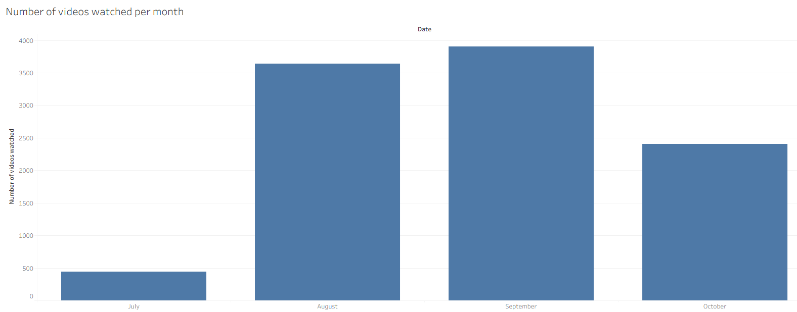

# Youtube-Watch-History-Visualization
Visualization of my personal Youtube watch history from July 2025 to October 2025 using Python, SQL, AWS Athena and Tableau

## Background and overview
This project analyzes my personal YouTube watch history from late-July to October 2025 to uncover insights about my viewing patterns on Youtube. Using data exported from Google Takeout, I preprocessed the raw JSON files in Python, uploaded the cleaned dataset to AWS S3, and queried it with AWS Athena for some exploratory data analysis.

The results were visualized in Tableau to explore trends such as how my viewing habits changed across months, which weekdays I watched most often, and what times of day I was most active on YouTube.

## How was the data preprocessed?
The raw YouTube watch history JSON file from Google Takeout was loaded in Python and cleaned using pandas. Only key fields such as the channel name, date, and time were extracted. Since I was based in the UK (UTC+1) before late-August 2024 and in Malaysia (UTC+8) afterward, timestamps were converted accordingly and split into separate date and time columns before being saved as a CSV file for analysis.

## Findings from the analysis

From the number of videos watched per month, July appears to have the lowest number of videos watched. However, since the data only begins in late July, this lower count is expected. If the data for the entire month were available, July’s total would likely be comparable to those of August and September. The decline in videos watched from September to October also makes sense, as that was when I began cutting down on my Internet consumption.

From the number of videos watched per day, Monday appears to be the peak of my YouTube activity for the week. This gradually tapers off as the weekend approaches, which makes sense since I usually plan social activities during weekends.

If we look at the number of videos watched by the hour everyday, there are three peaks, which are around 1 AM, 1 PM, and 8–9 PM. The late night peak reflects my habit of watching some Youtube videos before heading to bed, whereas my midday peak and late evening peak reflects my habit of watching Youtube videos while I am eating lunch and dinner respectively.

## Limitations
Google Takeout does not differentiate between full-length YouTube videos and YouTube Shorts, as they are classified the same. This makes it difficult to accurately analyze viewing patterns or time spent based on video type, since short-form content can heavily skew the total number of videos watched.
